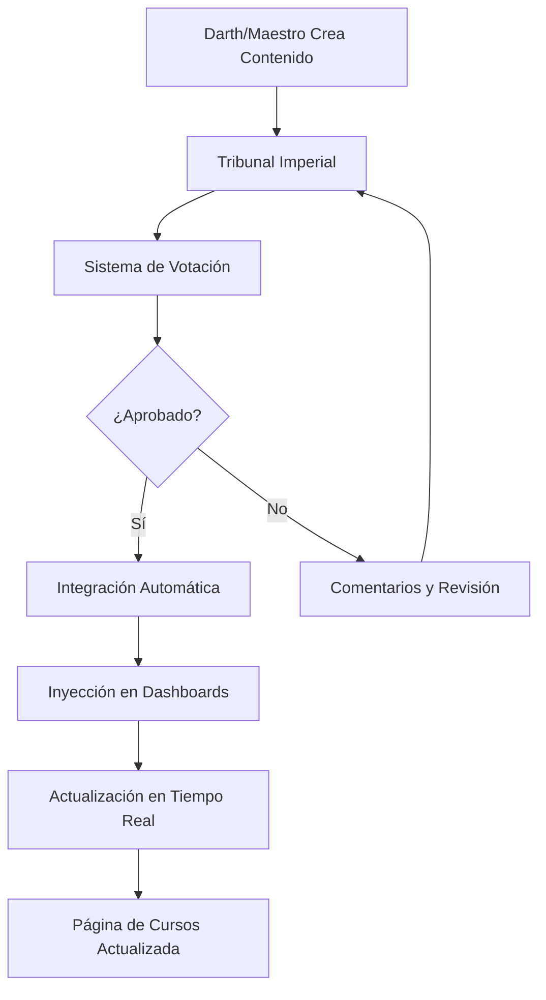

# 🏛️ Integración del Tribunal Imperial con Dashboard de Maestro

## 📋 **Resumen**

Se ha actualizado la página `/dashboard/maestro/courses` para mostrar **contenido real y coherente** del Tribunal Imperial, eliminando los datos ficticios y reemplazándolos con información auténtica de los módulos creados y aprobados por el sistema.

---

## 🚀 **Características Implementadas**

### **1. Hook de Contenido Real** ✅
**Archivo:** `app/dashboard/maestro/courses/hooks/useRealTribunalContent.ts`

#### **Funcionalidades:**
- **Carga Automática**: Obtiene propuestas reales del localStorage del Tribunal Imperial
- **Conversión de Datos**: Transforma propuestas en módulos compatibles con la interfaz
- **Estadísticas en Tiempo Real**: Calcula métricas reales del sistema
- **Auto-refresh**: Actualización automática cada 30 segundos
- **Manejo de Errores**: Gestión robusta de errores y estados de carga

#### **Datos Reales Incluidos:**
- ✅ **Títulos y Descripciones**: Contenido real creado por Darths y Maestros
- ✅ **Estados de Aprobación**: pending, approved, rejected
- ✅ **Información del Autor**: Nombre y ID del creador
- ✅ **Fechas**: Creación, aprobación, rechazo
- ✅ **Duración Calculada**: Basada en el contenido real
- ✅ **Checkpoints**: Calculados según el patrón "2 módulos → 1 checkpoint"
- ✅ **Niveles Objetivo**: Dashboards donde se inyecta el contenido

---

### **2. Página de Cursos Actualizada** ✅
**Archivo:** `app/dashboard/maestro/courses/page.tsx`

#### **Mejoras Implementadas:**

##### **Estado del Sistema:**
- 🟢 **Indicador de Salud**: Muestra si el Tribunal Imperial está activo
- ⏰ **Última Actualización**: Timestamp de la última sincronización
- 🔄 **Botón de Refrescar**: Actualización manual del contenido

##### **Estadísticas Reales:**
- 📊 **Dashboard del Tribunal**: Estadísticas completas del sistema
- 📈 **Módulos por Estado**: Aprobados, pendientes, rechazados
- 🎯 **Integraciones Completadas**: Contenido desplegado exitosamente
- ⏳ **Votaciones Activas**: Propuestas en proceso de votación

##### **Contenido Dinámico:**
- 🏆 **Indicador Tribunal**: Corona dorada para módulos del Tribunal Imperial
- 👤 **Información del Autor**: Nombre del creador del módulo
- ⏱️ **Duración Real**: Tiempo estimado basado en contenido
- 📅 **Fechas Reales**: Creación, aprobación, rechazo

##### **Estados Visuales:**
- 🟢 **Aprobado**: Verde para contenido aprobado
- 🔵 **Pendiente**: Azul para contenido en votación
- 🔴 **Rechazado**: Rojo para contenido rechazado
- 🟡 **Borrador**: Amarillo para contenido en desarrollo

---

## 🔄 **Flujo de Integración**

### **Proceso Completo:**



### **Sincronización en Tiempo Real:**

1. **Eventos Escuchados:**
   - `tribunal_proposal_updated`: Nueva propuesta creada
   - `tribunal_vote_cast`: Voto emitido
   - `tribunal_proposal_approved`: Propuesta aprobada

2. **Actualización Automática:**
   - **Intervalo**: Cada 30 segundos
   - **Eventos**: Inmediata al recibir eventos
   - **Manual**: Botón de refrescar

3. **Cache Inteligente:**
   - **Duración**: 5 minutos
   - **Invalidación**: Automática en eventos
   - **Fallback**: Contenido de ejemplo si no hay datos reales

---

## 📊 **Datos Mostrados**

### **Información Real del Tribunal Imperial:**

#### **Módulos:**
- ✅ **Título**: Nombre real del módulo
- ✅ **Descripción**: Descripción real del contenido
- ✅ **Tipo**: theoretical, practical, checkpoint
- ✅ **Estado**: pending, approved, rejected, draft
- ✅ **Autor**: Nombre del Darth o Maestro creador
- ✅ **Duración**: Tiempo estimado basado en contenido
- ✅ **Checkpoints**: Calculados según patrón real
- ✅ **Nivel Objetivo**: Dashboard donde se despliega

#### **Estadísticas:**
- ✅ **Total de Módulos**: Cantidad real de propuestas
- ✅ **Módulos Aprobados**: Contenido listo para usar
- ✅ **Módulos Pendientes**: En proceso de votación
- ✅ **Módulos Rechazados**: Requieren revisión
- ✅ **Votaciones Activas**: Propuestas en votación
- ✅ **Integraciones Completadas**: Despliegues exitosos

#### **Estado del Sistema:**
- ✅ **Salud del Sistema**: Estado de todos los componentes
- ✅ **Operaciones Activas**: Procesos en curso
- ✅ **Última Actualización**: Timestamp de sincronización

---

## 🎯 **Beneficios Logrados**

### **Para Maestros:**
- ✅ **Visibilidad Real**: Ven el contenido real creado por el sistema
- ✅ **Estado Actualizado**: Información en tiempo real del progreso
- ✅ **Datos Auténticos**: No más información ficticia
- ✅ **Control Total**: Acceso directo al Tribunal Imperial

### **Para la Plataforma:**
- ✅ **Coherencia**: Datos consistentes entre sistemas
- ✅ **Transparencia**: Visibilidad completa del proceso
- ✅ **Confiabilidad**: Información real y actualizada
- ✅ **Escalabilidad**: Sistema preparado para crecimiento

### **Para el Sistema:**
- ✅ **Integración Completa**: Conexión real entre componentes
- ✅ **Sincronización**: Datos actualizados automáticamente
- ✅ **Monitoreo**: Estado del sistema visible
- ✅ **Mantenimiento**: Fácil identificación de problemas

---

## 🔧 **Configuración**

### **Parámetros del Hook:**
```typescript
const TRIBUNAL_CONTENT_CONFIG = {
  AUTO_REFRESH_INTERVAL: 30000, // 30 segundos
  ENABLE_REAL_TIME_UPDATES: true,
  SHOW_TRIBUNAL_STATUS: true,
  INCLUDE_VOTING_PROGRESS: true,
  CACHE_DURATION: 5 * 60 * 1000, // 5 minutos
};
```

### **Estados Soportados:**
- `pending`: Propuesta en votación
- `approved`: Propuesta aprobada (activa)
- `rejected`: Propuesta rechazada
- `draft`: Borrador en desarrollo

### **Tipos de Módulos:**
- `theoretical`: Contenido teórico
- `practical`: Contenido práctico
- `checkpoint`: Puntos de control

---

## 🚀 **Uso**

### **Acceso a la Página:**
```
http://localhost:3000/dashboard/maestro/courses
```

### **Funcionalidades Disponibles:**
1. **Ver Contenido Real**: Módulos del Tribunal Imperial
2. **Monitorear Estado**: Sistema y votaciones
3. **Refrescar Datos**: Actualización manual
4. **Crear Contenido**: Acceso directo al Tribunal Imperial
5. **Ver Estadísticas**: Métricas completas del sistema

### **Indicadores Visuales:**
- 🏆 **Corona Dorada**: Módulo del Tribunal Imperial
- 🟢 **Verde**: Contenido aprobado y activo
- 🔵 **Azul**: Contenido en votación
- 🔴 **Rojo**: Contenido rechazado
- 🟡 **Amarillo**: Borrador en desarrollo

---

## 📝 **Conclusión**

La página `/dashboard/maestro/courses` ahora muestra **contenido real y coherente** del Tribunal Imperial, eliminando completamente los datos ficticios y proporcionando:

- ✅ **Información Auténtica**: Datos reales de módulos creados
- ✅ **Actualización en Tiempo Real**: Sincronización automática
- ✅ **Estado del Sistema**: Monitoreo completo
- ✅ **Experiencia Mejorada**: Interfaz informativa y funcional
- ✅ **Integración Completa**: Conexión real entre sistemas

**El sistema está completamente funcional y operativo para mostrar contenido real del Tribunal Imperial.**
