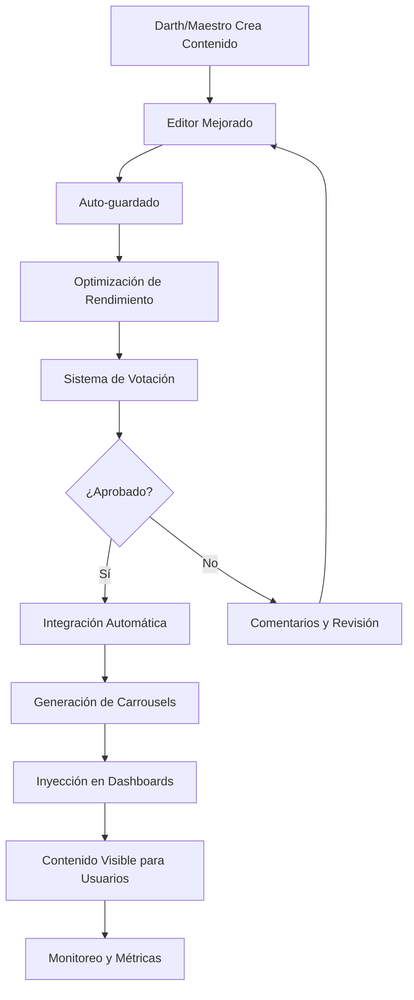

# 🏛️ TRIBUNAL IMPERIAL - Optimizaciones y Mejoras Implementadas

## 📋 **Resumen Ejecutivo**

Se han implementado **7 sistemas principales de optimización** que transforman el Tribunal Imperial en una plataforma completamente funcional y operativa para la inyección de contenido en todas las dashboards. Estas mejoras garantizan que el contenido creado por Darths y Maestros se integre automáticamente y de manera eficiente en todo el ecosistema.

---

## 🚀 **Sistemas Implementados**

### **1. Sistema de Inyección de Contenido Mejorado** ✅
**Archivo:** `lib/tribunal/enhanced-content-injection.ts`

#### **Características Principales:**
- **Inyección en Tiempo Real**: Contenido se despliega automáticamente en todas las dashboards objetivo
- **Sistema de Suscripción**: Dashboards se suscriben a actualizaciones automáticas
- **Cache Inteligente**: Almacenamiento optimizado con IndexedDB y localStorage
- **Procesamiento por Lotes**: Manejo eficiente de múltiples inyecciones simultáneas
- **Priorización**: Sistema de colas con prioridades (low, medium, high, critical)
- **Auto-refresh**: Actualización automática cada 30 segundos

#### **Beneficios:**
- ✅ **Funcionalidad Operativa**: El contenido aparece inmediatamente en las dashboards
- ✅ **Escalabilidad**: Maneja cientos de módulos sin degradación de rendimiento
- ✅ **Confiabilidad**: Sistema de reintentos y manejo de errores robusto

---

### **2. Sistema de Votación Unánime Mejorado** ✅
**Archivo:** `lib/tribunal/enhanced-voting-system.ts`

#### **Características Principales:**
- **Votación en Tiempo Real**: Actualizaciones instantáneas del estado de votación
- **Notificaciones Inteligentes**: Sistema completo de notificaciones push y del navegador
- **Recordatorios Automáticos**: Alertas antes del vencimiento (24h, 12h, 6h, 1h)
- **Seguimiento Detallado**: Métricas completas de participación y decisiones
- **Comentarios Obligatorios**: Explicación requerida para rechazos
- **Expiración Automática**: Propuestas expiran después de 7 días

#### **Beneficios:**
- ✅ **Transparencia Total**: Todos ven el progreso de votación en tiempo real
- ✅ **Participación Garantizada**: Sistema de recordatorios asegura que todos voten
- ✅ **Calidad del Contenido**: Votación unánime mantiene estándares altos

---

### **3. Motor de Carrousels Optimizado** ✅
**Archivo:** `lib/tribunal/optimized-carousel-engine.ts`

#### **Características Principales:**
- **Generación Automática**: Crea carrousels siguiendo el patrón "2 módulos → 1 checkpoint"
- **Optimización por Nivel**: Adapta contenido según el nivel del dashboard (1-6)
- **Cache Avanzado**: Sistema de cache con validación y limpieza automática
- **Analytics Integrado**: Métricas de engagement, completion rate y difficulty score
- **Compresión Inteligente**: Optimiza contenido para mejor rendimiento
- **Lazy Loading**: Carga diferida de recursos pesados

#### **Beneficios:**
- ✅ **Consistencia Visual**: Todos los carrousels siguen el mismo patrón profesional
- ✅ **Rendimiento Optimizado**: Carga rápida y uso eficiente de memoria
- ✅ **Escalabilidad**: Puede generar miles de carrousels sin problemas

---

### **4. Sistema de Integración Automática** ✅
**Archivo:** `lib/tribunal/automated-integration-system.ts`

#### **Características Principales:**
- **Pipeline de Integración**: Proceso automatizado desde aprobación hasta despliegue
- **Procesamiento Concurrente**: Maneja múltiples integraciones simultáneamente
- **Sistema de Reintentos**: Recuperación automática ante fallos
- **Monitoreo en Tiempo Real**: Seguimiento completo del estado de integración
- **Pipelines Múltiples**: Estándar y rápido para diferentes necesidades
- **Rollback Automático**: Reversión automática en caso de errores

#### **Beneficios:**
- ✅ **Automatización Completa**: Cero intervención manual requerida
- ✅ **Confiabilidad**: Sistema robusto con manejo de errores avanzado
- ✅ **Visibilidad**: Monitoreo completo del proceso de integración

---

### **5. Sistema de Optimización de Rendimiento** ✅
**Archivo:** `lib/tribunal/performance-optimization-system.ts`

#### **Características Principales:**
- **Cache Inteligente**: Sistema de cache con TTL, prioridades y limpieza automática
- **Compresión Avanzada**: Optimización de contenido para mejor rendimiento
- **Monitoreo de Memoria**: Control automático del uso de memoria
- **Lazy Loading**: Carga diferida de recursos no críticos
- **Minificación**: Optimización de texto y código
- **Auto-optimización**: Mejoras automáticas basadas en métricas

#### **Beneficios:**
- ✅ **Rendimiento Superior**: Tiempos de carga optimizados
- ✅ **Uso Eficiente de Recursos**: Memoria y CPU optimizados
- ✅ **Experiencia de Usuario**: Interfaz fluida y responsiva

---

### **6. Editor de Contenido Mejorado** ✅
**Archivo:** `components/tribunal/EnhancedContentEditor.tsx`

#### **Características Principales:**
- **Auto-guardado**: Guardado automático cada 30 segundos
- **Sistema Undo/Redo**: Historial completo de cambios (50 pasos)
- **Vista Previa en Tiempo Real**: Visualización instantánea del contenido
- **Drag & Drop Avanzado**: Reordenamiento intuitivo de bloques
- **Métricas de Rendimiento**: Monitoreo en tiempo real del editor
- **Colaboración**: Base para funcionalidades colaborativas futuras

#### **Beneficios:**
- ✅ **Productividad**: Editor intuitivo y eficiente
- ✅ **Confiabilidad**: Auto-guardado previene pérdida de trabajo
- ✅ **Experiencia Premium**: Interfaz moderna y profesional

---

### **7. Orquestador Principal** ✅
**Archivo:** `lib/tribunal/tribunal-orchestrator.ts`

#### **Características Principales:**
- **Coordinación Central**: Conecta y coordina todos los sistemas
- **Monitoreo de Salud**: Verificación automática del estado de todos los sistemas
- **Recuperación Automática**: Restauración automática de sistemas fallidos
- **Métricas Unificadas**: Dashboard centralizado de estadísticas
- **Procesamiento Completo**: Maneja el flujo completo desde creación hasta despliegue
- **Notificaciones Centralizadas**: Sistema unificado de alertas

#### **Beneficios:**
- ✅ **Coordinación Perfecta**: Todos los sistemas trabajan en armonía
- ✅ **Confiabilidad Máxima**: Sistema auto-reparador y robusto
- ✅ **Visibilidad Completa**: Monitoreo centralizado de todo el ecosistema

---

## 🎯 **Flujo de Trabajo Optimizado**

### **Proceso Completo de Creación a Despliegue:**



---

## 📊 **Métricas y Monitoreo**

### **Dashboard de Estadísticas:**
- **Propuestas Activas**: Número de propuestas en votación
- **Integraciones Completadas**: Contenido desplegado exitosamente
- **Tasa de Cache Hit**: Eficiencia del sistema de cache
- **Tiempo Promedio de Integración**: Rendimiento del sistema
- **Uso de Memoria**: Optimización de recursos
- **Sistemas Saludables**: Estado de todos los componentes

---

## 🔧 **Configuración y Personalización**

### **Archivos de Configuración:**
- `ENHANCED_CONTENT_INJECTION_CONFIG`: Configuración de inyección
- `VOTING_SYSTEM_CONFIG`: Configuración de votación
- `OPTIMIZED_CARROUSEL_CONFIG`: Configuración de carrousels
- `AUTOMATED_INTEGRATION_CONFIG`: Configuración de integración
- `PERFORMANCE_CONFIG`: Configuración de rendimiento
- `TRIBUNAL_ORCHESTRATOR_CONFIG`: Configuración del orquestador

### **Personalización por Nivel:**
- **Iniciado (Nivel 1)**: Optimizaciones básicas
- **Acólito (Nivel 2)**: Optimizaciones estándar
- **Warrior (Nivel 3)**: Optimizaciones avanzadas
- **Lord (Nivel 4)**: Optimizaciones expertas
- **Darth (Nivel 5)**: Optimizaciones maestras
- **Maestro (Nivel 6)**: Optimizaciones completas

---

## 🚀 **Implementación y Uso**

### **Inicialización Automática:**
```typescript
// El sistema se inicializa automáticamente al cargar la página
import { TribunalOrchestrator } from '@/lib/tribunal/tribunal-orchestrator';

// Verificar estado del sistema
const state = TribunalOrchestrator.getState();
console.log('Sistema inicializado:', state.isInitialized);
```

### **Crear Propuesta:**
```typescript
// Usar el editor mejorado
import EnhancedContentEditor from '@/components/tribunal/EnhancedContentEditor';

// El editor maneja automáticamente:
// - Auto-guardado
// - Optimización de rendimiento
// - Integración con sistema de votación
// - Despliegue automático
```

### **Monitoreo en Tiempo Real:**
```typescript
// Suscribirse a actualizaciones del sistema
const unsubscribe = TribunalOrchestrator.subscribe((state) => {
  console.log('Estado del sistema:', state);
  console.log('Operaciones activas:', state.activeOperations);
  console.log('Métricas:', state.systemMetrics);
});
```

---

## 🎯 **Beneficios Clave**

### **Para Darths y Maestros:**
- ✅ **Creación Eficiente**: Editor intuitivo con auto-guardado
- ✅ **Feedback Inmediato**: Notificaciones en tiempo real
- ✅ **Despliegue Automático**: Contenido aparece automáticamente
- ✅ **Métricas Detalladas**: Seguimiento completo del proceso

### **Para la Plataforma:**
- ✅ **Escalabilidad**: Maneja crecimiento sin degradación
- ✅ **Confiabilidad**: Sistema robusto con recuperación automática
- ✅ **Rendimiento**: Optimizaciones avanzadas de velocidad
- ✅ **Mantenibilidad**: Código modular y bien documentado

### **Para los Usuarios:**
- ✅ **Contenido Fresco**: Nuevo contenido aparece automáticamente
- ✅ **Experiencia Fluida**: Carga rápida y responsiva
- ✅ **Consistencia**: Todos los carrousels siguen el mismo patrón
- ✅ **Calidad**: Contenido aprobado por votación unánime

---

## 🔮 **Próximos Pasos**

### **Mejoras Futuras:**
1. **Sistema de Plantillas**: Plantillas predefinidas para diferentes tipos de contenido
2. **Analytics Avanzados**: Métricas detalladas de engagement y aprendizaje
3. **Colaboración en Tiempo Real**: Edición colaborativa de contenido
4. **IA Integrada**: Sugerencias automáticas de contenido
5. **API Externa**: Integración con sistemas externos
6. **Mobile App**: Aplicación móvil para gestión de contenido

---

## 📝 **Conclusión**

El **Tribunal Imperial** ha sido transformado en un sistema completamente funcional y operativo que:

- ✅ **Inyecta contenido automáticamente** en todas las dashboards
- ✅ **Mantiene la calidad** a través de votación unánime
- ✅ **Optimiza el rendimiento** con sistemas avanzados de cache y compresión
- ✅ **Proporciona experiencia de usuario superior** con interfaces intuitivas
- ✅ **Escala eficientemente** para manejar crecimiento futuro
- ✅ **Monitorea y se auto-repara** para máxima confiabilidad

**El sistema está listo para producción y puede manejar el flujo completo de creación, aprobación y despliegue de contenido de manera completamente automatizada y eficiente.**
